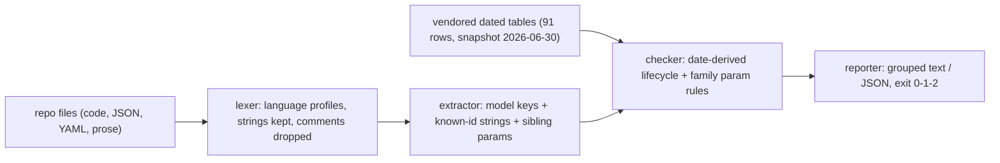

# modelsweep

[English](README.md) | [中文](README.zh.md) | [日本語](README.ja.md)

[](LICENSE)   [](CONTRIBUTING.md)

**リポジトリ内の廃止済みモデル id と不正なパラメータ組み合わせを検出する、オープンソース・依存ゼロのプリフライトスキャナ——日付入りの廃止テーブルを同梱し、モデルの引退が本番を壊す前に CI を失敗させる。**


```bash
# not yet on npm — install from a checkout of this repository
npm install && npm run build && npm pack
npm install -g ./modelsweep-0.1.0.tgz
```

## なぜ modelsweep なのか？

モデルの引退はベンダーのスケジュールで本番環境を壊す。あなたの都合ではない。2024 年にピン留めしたあの id はシャットダウン日の当日まで普通に動き、その日を境に全リクエストが 404 になる——それを参照するコードが最後に開かれたのは十八ヶ月前だ。既存の答えはどれも同じ盲点を抱えている。ベンダーのカタログやルーターのレジストリは*どの*モデルが存在するかは知っていても*あなたの*コードは一切見ない。ランタイムの廃止警告はリクエストが劣化し始めた後に本番ログへ届く。CI でモデル名を grep しても文字列が見つかるだけで、そのひとつが 24 日後に死ぬことは何も分からない。modelsweep は SDK でもルーターでもプロキシでもない。プリフライトスキャンだ。五つのプロバイダについてベンダーが公告した廃止・シャットダウンの**日付**を収めた同梱テーブルと、コード・JSON・YAML からモデル参照を見つけ出す抽出器——さらにその隣に書かれたリクエストパラメータも lint する（Claude モデルでの `temperature: 1.2`、推論モデルでのあらゆる `temperature`、当該パラメータを廃したファミリーでの `budget_tokens`）。判定はスキャン時に日付から導出されるため、予定されたシャットダウンは日が近づくにつれ警告からエラーへ昇格し、`--at` で前四半期の判定を再現でき、CI の一行でこの種の障害を丸ごと防げる。

|  | modelsweep | ルーターカタログ（LiteLLM） | モデルデータベース（models.dev） | CI での grep |
|---|---|---|---|---|
| 目的 | リポジトリのプリフライトスキャン | ルーター向けの価格/上限データ | 閲覧用のモデルメタデータ | 文字列検索 |
| コードをスキャン | はい——コード、JSON、YAML、文書 | いいえ | いいえ | 行のみ、文脈なし |
| 日数計算付きシャットダウン日 | はい、警告→エラーの猶予窓 | 部分的な日付、日数計算なし | 部分的、機械検証なし | いいえ |
| パラメータ lint | はい、モデルファミリー単位 | いいえ | いいえ | いいえ |
| タイポ検出 | はい、モデルキーに did-you-mean | いいえ | いいえ | いいえ |
| オフライン動作 | はい、データは同梱 | はい | いいえ、Web サイト/API | はい |
| ランタイム依存 | 0 | ~25 | 該当なし | 該当なし |

<sub>機能と依存数は各プロジェクトの公開ドキュメントとパッケージメタデータで照合、2026-07。</sub>

## 特長

- **ステータスラベルではなく日付入りテーブル**——全行がベンダー公告の廃止・シャットダウン日を保持し、ステータスはスキャン時に導出される。`--at 2027-01-01` で来年の障害を今日確認でき、`--within 90` は移行が間に合ううちに迫るシャットダウンをエラーへ変える。
- **コードの実際の書き方どおりに参照を発見**——JS/TS オブジェクト、Python kwargs、Go 構造体、JSON、YAML の `model:` キー。あらゆる文字列リテラル内の既知 id。Markdown 内の言及。コメントは決してヒットせず、言語対応の字句解析が Python コメントの `#` と URL 内の `#` を混同させない。
- **モデル id のすぐ隣でパラメータ lint**——抽出器は同一呼び出しから `temperature`、`top_p`、`max_tokens`、ネストした `budget_tokens` などを捕捉し、参照モデルのファミリーに照らして検査する：拒否されるパラメータ（E103）、範囲外リテラル（E104）、衝突する組み合わせ（E105）、廃止された名前（W204）、必須パラメータの欠落（W205）。
- **導出可能な指摘すべてに修正案**——引退モデルにはベンダー推奨の後継を、浮動エイリアスにはピン留めすべきスナップショットを、タイポした id には did-you-mean を、Chat Completions の `max_tokens` には `max_completion_tokens` を提示する。
- **CI のために設計**——決定的な出力、`--format json`、`--strict`、許容済み例外のための繰り返し可能な `--allow`、指摘（1）と使用法エラー（2）を区別する終了コード。すべてのレポートがデータセットのスナップショット日付を印字し、古さを隠さず可視化する。
- **ランタイム依存ゼロ、完全オフライン**——必要なのは Node.js だけ。廃止データはレビュー可能なソースとしてパッケージに同梱され、ツールがソケットを開くことは決してない。

## クイックスタート

インストール：

```bash
# not yet on npm — install from a checkout of this repository
npm install && npm run build && npm pack
npm install -g ./modelsweep-0.1.0.tgz
```

同梱レガシーアプリの TypeScript クライアントに向けてみる——一年間誰も開いていないコード：

```bash
modelsweep scan examples/legacy-app/client.ts --at 2026-07-12
```

出力（実際にキャプチャした実行結果）：

```text
examples/legacy-app/client.ts: 5 finding(s)

  9:13  claude-opus-4-1
    error E102: shutdown imminent: claude-opus-4-1 resolves to claude-opus-4-1-20250805, which is scheduled for shutdown on 2026-08-05 — 24 day(s) after 2026-07-12
        fix: migrate to claude-opus-4-8
    warning W202: floating alias: claude-opus-4-1 points at a different snapshot over time (currently claude-opus-4-1-20250805)
        fix: pin claude-opus-4-1-20250805 explicitly

  11:5  claude-opus-4-1
    error E105: temperature and top_p are both set — claude-opus-4-1 rejects requests that set both
        fix: keep one of them

  18:32  claude-3-5-sonnet-latest
    error E101: retired model: claude-3-5-sonnet-latest resolves to claude-3-5-sonnet-20241022, which was shut down on 2025-10-28 (257 day(s) before 2026-07-12)
        fix: migrate to claude-sonnet-5
    warning W202: floating alias: claude-3-5-sonnet-latest points at a different snapshot over time (currently claude-3-5-sonnet-20241022)
        fix: pin claude-3-5-sonnet-20241022 explicitly

dataset snapshot 2026-06-30, evaluated at 2026-07-12
scanned 1 file(s), 2 model reference(s): FAIL (3 error(s), 2 warning(s))
```

終了コード 1——そのまま CI に入れられる。`examples/legacy-app` ツリー全体をスキャンすると、Python ジョブ・この TypeScript クライアント・YAML 設定にまたがって 10 エラー・4 警告になる。`--at 2024-01-01` で再実行すればライフサイクル系の指摘は消える。当時はまだ何も廃止されていなかったからだ。単一の id を問い詰めるには（実際にキャプチャした実行結果）：

```bash
modelsweep explain claude-opus-4-1 --at 2026-07-12
```

```text
claude-opus-4-1
  provider:     anthropic
  family:       anthropic-4
  resolves to:  claude-opus-4-1-20250805 (floating alias)
  status:       deprecated (as of 2026-07-12)
  deprecated:   2026-02-05
  shutdown:     2026-08-05
  replacement:  claude-opus-4-8
  parameter rules (anthropic-4):
    - temperature must be within 0..1
    - top_p must be within 0..1
    - top_k must be an integer >= 0
    - max_tokens is required on every request
    - temperature and top_p must not be set together
    - budget_tokens needs >= 1024 and < max_tokens
```

さらに多くのシナリオは [examples/](examples/README.md) に。

## ルール

エラー（E1xx）はリクエストがベンダー API で失敗する（既にしている）ことを、警告（W2xx）はレビューに値するドリフトを意味する。コードは安定 API であり、番号の振り直しはしない。各ルールの完全な根拠は [docs/rules.md](docs/rules.md) を参照。

| ルール | 深刻度 | 検査内容 |
|---|---|---|
| E101 | error | 参照日時点で公告済みシャットダウン日を過ぎたモデル |
| E102 | error | `--within` の猶予窓（既定 90 日）内に予定されたシャットダウン |
| E103 | error | モデルファミリーが即座に拒否するパラメータ（例：推論モデルの `temperature`） |
| E104 | error | 範囲外・不正なリテラル（Claude の `temperature: 1.2`、`budget_tokens < 1024`） |
| E105 | error | 衝突する組み合わせ（Claude 4.x の `temperature` + `top_p`、`budget_tokens >= max_tokens`） |
| W201 | warning | 廃止済みだがシャットダウンは猶予窓の外、または未公告 |
| W202 | warning | 浮動エイリアス——現在解決される日付付きスナップショットをピン留めせよ |
| W203 | warning | ベンダーが片方のみの調整を推奨する場面での `temperature` + `top_p` |
| W204 | warning | 廃止されたパラメータ名（Chat Completions の `max_tokens`） |
| W205 | warning | 可視の呼び出しに必須パラメータが欠落（Anthropic の `max_tokens`） |
| W206 | warning | 対応プロバイダの接頭辞を持つ未知の id——大抵はタイポ、did-you-mean 付き |

## CLI リファレンス

`modelsweep scan [paths...]` がスキャン（既定 `.`）。`modelsweep models` は同梱テーブルを印字し、`modelsweep explain <id>` は単一 id を詳解する。データセットは OpenAI・Anthropic・Google・Mistral・Cohere をカバー——スナップショット 2026-06-30 で 91 行（出典と更新ポリシーは [docs/dataset.md](docs/dataset.md)）。

| フラグ | 既定値 | 効果 |
|---|---|---|
| `--at <YYYY-MM-DD>` | 今日 | すべてのライフサイクルをこの日付で評価（再現可能な CI、タイムトラベル） |
| `--within <days>` | `90` | N 日以内に予定されたシャットダウンを警告からエラーへ昇格 |
| `--format text\|json` | `text` | レポート形式。JSON は CI 後処理向けの安定した構造 |
| `--strict` | オフ | 警告でも実行を失敗させる（終了コード 1） |
| `--allow <model-id>` | — | 特定 id のモデルレベル指摘を抑制（繰り返し可） |
| `-q, --quiet` | オフ | データセット行とサマリ行のみ出力 |

終了コード：`0` クリーン、`1` 指摘あり（または `--strict` 下の警告）、`2` 使用法/IO エラー——スクリプトは「死にゆくモデル」と「壊れた呼び出し」を区別できる。

## アーキテクチャ



## ロードマップ

- [x] 五プロバイダの日付入り廃止テーブル、二チャネル抽出、ファミリー別パラメータ lint、11 ルールのカタログ、`--at`/`--within` の日付演算、scan/models/explain CLI、JSON 出力（v0.1.0）
- [ ] `--refresh` 補助スクリプト：同梱データ方式を保ったままベンダー公告からテーブルを再生成
- [ ] ファインチューニング id 対応（`ft:gpt-…` をベースモデル行へマッピング）
- [ ] Azure/Bedrock/Vertex のプラットフォーム別 id 表記とプラットフォーム固有の引退日
- [ ] コードスキャニング統合向け SARIF 出力

全リストは [open issues](https://github.com/JaydenCJ/modelsweep/issues) を参照。

## コントリビュート

コントリビュート歓迎——出典付きのデータ修正はとりわけ歓迎。`npm install && npm run build` でビルドし、`npm test`（90 テスト）と `bash scripts/smoke.sh`（`SMOKE OK` を印字すること）を実行する——このリポジトリは CI を同梱せず、上記の主張はすべてローカル実行で検証される。[CONTRIBUTING.md](CONTRIBUTING.md) を読み、[good first issue](https://github.com/JaydenCJ/modelsweep/issues?q=is%3Aissue+is%3Aopen+label%3A%22good+first+issue%22) を手に取るか、[discussion](https://github.com/JaydenCJ/modelsweep/discussions) を始めてほしい。

## ライセンス

[MIT](LICENSE)
