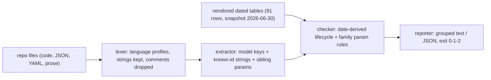

# modelsweep

[English](README.md) | [中文](README.zh.md) | [日本語](README.ja.md)

[](LICENSE)   [](CONTRIBUTING.md)

**An open-source, zero-dependency preflight scanner that catches deprecated model ids and invalid parameter combos in your repo — vendored, dated deprecation tables mean it fails CI before a model retirement fails prod.**


```bash
# not yet on npm — install from a checkout of this repository
npm install && npm run build && npm pack
npm install -g ./modelsweep-0.1.0.tgz
```

## Why modelsweep?

Model retirements break production on the vendor's schedule, not yours. The id you pinned in 2024 keeps working right up until its shutdown date, then every request 404s — and the code that references it was last opened eighteen months ago. The existing answers all have the same gap: vendor catalogs and router registries know *which* models exist but never look at *your* code; runtime deprecation warnings arrive in production logs after the requests already degraded; and a grep for model names finds strings but has no idea that one of them dies in 24 days. modelsweep is neither an SDK, a router, nor a proxy. It is a preflight scan: a vendored table of vendor-announced deprecation and shutdown **dates** for five providers, plus an extractor that finds model references in code, JSON and YAML — and lints the request parameters written next to them (`temperature: 1.2` on a Claude model, `temperature` at all on a reasoning model, `budget_tokens` on a family that removed it). Verdicts are derived from dates at scan time, so a scheduled shutdown escalates from warning to error as the day approaches, `--at` reproduces last quarter's verdict, and one CI line stops the whole class of outage.

|  | modelsweep | router catalogs (LiteLLM) | model databases (models.dev) | grep in CI |
|---|---|---|---|---|
| Purpose | preflight scan of your repo | pricing/limits data for a router | browsable model metadata | string search |
| Scans your code | yes — code, JSON, YAML, prose | no | no | lines only, no context |
| Shutdown dates with day math | yes, warning→error horizon | partial dates, no day math | partial, not machine-checked | no |
| Parameter linting | yes, per model family | no | no | no |
| Typo detection | yes, did-you-mean on model keys | no | no | no |
| Works offline | yes, data is vendored | yes | no, it is a website/API | yes |
| Runtime dependencies | 0 | ~25 | n/a | n/a |

<sub>Capability and dependency counts checked against each project's public docs and package metadata, 2026-07.</sub>

## Features

- **Dated tables, not status labels** — every row carries the vendor-announced deprecation and shutdown dates; status is derived at scan time, so `--at 2027-01-01` shows you next year's failures today and `--within 90` turns approaching shutdowns into errors while there is still time to migrate.
- **Finds references the way code actually writes them** — `model:` keys in JS/TS objects, Python kwargs, Go structs, JSON and YAML; known ids inside any string literal; prose mentions in Markdown. Comments never match, and language-aware lexing keeps `#` in a Python comment from hiding what `#` in a URL should not.
- **Parameter linting next to the model id** — the extractor captures `temperature`, `top_p`, `max_tokens`, nested `budget_tokens` and friends from the same call, then checks them against the referenced model's family: rejected params (E103), out-of-range literals (E104), conflicting combos (E105), deprecated names (W204), missing required params (W205).
- **A fix on every derivable finding** — retired models name their vendor-recommended replacement, floating aliases name the snapshot to pin, typo'd ids get a did-you-mean, and `max_tokens` on Chat Completions points at `max_completion_tokens`.
- **Built for CI** — deterministic output, `--format json`, `--strict`, repeatable `--allow` for accepted exceptions, and exit codes that distinguish findings (1) from usage errors (2); every report prints the dataset snapshot date so staleness is visible, never hidden.
- **Zero runtime dependencies, fully offline** — Node.js is the only requirement; the deprecation data ships inside the package as reviewable source, and the tool never opens a socket.

## Quickstart

Install:

```bash
# not yet on npm — install from a checkout of this repository
npm install && npm run build && npm pack
npm install -g ./modelsweep-0.1.0.tgz
```

Point it at the TypeScript client of the bundled legacy app — code nobody has opened in a year:

```bash
modelsweep scan examples/legacy-app/client.ts --at 2026-07-12
```

Output (real captured run):

```text
examples/legacy-app/client.ts: 5 finding(s)

  9:13  claude-opus-4-1
    error E102: shutdown imminent: claude-opus-4-1 resolves to claude-opus-4-1-20250805, which is scheduled for shutdown on 2026-08-05 — 24 day(s) after 2026-07-12
        fix: migrate to claude-opus-4-8
    warning W202: floating alias: claude-opus-4-1 points at a different snapshot over time (currently claude-opus-4-1-20250805)
        fix: pin claude-opus-4-1-20250805 explicitly

  11:5  claude-opus-4-1
    error E105: temperature and top_p are both set — claude-opus-4-1 rejects requests that set both
        fix: keep one of them

  18:32  claude-3-5-sonnet-latest
    error E101: retired model: claude-3-5-sonnet-latest resolves to claude-3-5-sonnet-20241022, which was shut down on 2025-10-28 (257 day(s) before 2026-07-12)
        fix: migrate to claude-sonnet-5
    warning W202: floating alias: claude-3-5-sonnet-latest points at a different snapshot over time (currently claude-3-5-sonnet-20241022)
        fix: pin claude-3-5-sonnet-20241022 explicitly

dataset snapshot 2026-06-30, evaluated at 2026-07-12
scanned 1 file(s), 2 model reference(s): FAIL (3 error(s), 2 warning(s))
```

Exit code 1 — drop it into CI as-is. Scanning the whole `examples/legacy-app` tree yields 10 errors and 4 warnings across a Python job, this TypeScript client and a YAML config; re-run with `--at 2024-01-01` and the lifecycle findings vanish, because back then nothing had been deprecated yet. To interrogate one id (real captured run):

```bash
modelsweep explain claude-opus-4-1 --at 2026-07-12
```

```text
claude-opus-4-1
  provider:     anthropic
  family:       anthropic-4
  resolves to:  claude-opus-4-1-20250805 (floating alias)
  status:       deprecated (as of 2026-07-12)
  deprecated:   2026-02-05
  shutdown:     2026-08-05
  replacement:  claude-opus-4-8
  parameter rules (anthropic-4):
    - temperature must be within 0..1
    - top_p must be within 0..1
    - top_k must be an integer >= 0
    - max_tokens is required on every request
    - temperature and top_p must not be set together
    - budget_tokens needs >= 1024 and < max_tokens
```

More scenarios live in [examples/](examples/README.md).

## Rules

Errors (E1xx) mean requests fail or already fail against the vendor's API; warnings (W2xx) mean drift worth reviewing. Codes are stable API, never renumbered. Full rationale per rule in [docs/rules.md](docs/rules.md).

| Rule | Severity | Checks |
|---|---|---|
| E101 | error | model past its announced shutdown date at the reference date |
| E102 | error | shutdown scheduled within the `--within` horizon (default 90 days) |
| E103 | error | parameter the model family rejects outright (e.g. `temperature` on reasoning models) |
| E104 | error | literal value out of range or invalid (`temperature: 1.2` on Claude, `budget_tokens < 1024`) |
| E105 | error | conflicting combination (`temperature` + `top_p` on Claude 4.x, `budget_tokens >= max_tokens`) |
| W201 | warning | deprecated, shutdown beyond the horizon or unannounced |
| W202 | warning | floating alias — pin the dated snapshot it currently resolves to |
| W203 | warning | `temperature` + `top_p` where the vendor advises tuning one |
| W204 | warning | deprecated parameter name (`max_tokens` on Chat Completions) |
| W205 | warning | required parameter missing from a visible call (`max_tokens` on Anthropic) |
| W206 | warning | unknown id under a covered provider prefix — usually a typo, did-you-mean attached |

## CLI reference

`modelsweep scan [paths...]` scans (default `.`); `modelsweep models` prints the vendored table; `modelsweep explain <id>` details one id. The dataset covers OpenAI, Anthropic, Google, Mistral and Cohere — 91 rows at snapshot 2026-06-30 (provenance and update policy in [docs/dataset.md](docs/dataset.md)).

| Flag | Default | Effect |
|---|---|---|
| `--at <YYYY-MM-DD>` | today | evaluate every lifecycle at this date (reproducible CI, time travel) |
| `--within <days>` | `90` | escalate scheduled shutdowns within N days from warning to error |
| `--format text\|json` | `text` | report format; JSON is a stable shape for CI post-processing |
| `--strict` | off | warnings also fail the run (exit 1) |
| `--allow <model-id>` | — | suppress model-level findings for an id (repeatable) |
| `-q, --quiet` | off | dataset and summary lines only |

Exit codes: `0` clean, `1` findings (or warnings under `--strict`), `2` usage/IO error — so scripts can tell a dying model from a broken invocation.

## Architecture



## Roadmap

- [x] Dated deprecation tables for five providers, two-channel extraction, family parameter linting, 11-rule catalog, `--at`/`--within` time math, scan/models/explain CLI, JSON output (v0.1.0)
- [ ] `--refresh` companion script to regenerate the table from vendor announcements, keeping the vendored-data model
- [ ] Fine-tuned id support (`ft:gpt-…` mapped to their base model rows)
- [ ] Azure/Bedrock/Vertex platform id spellings and platform-specific retirement dates
- [ ] SARIF output for code-scanning integrations

See the [open issues](https://github.com/JaydenCJ/modelsweep/issues) for the full list.

## Contributing

Contributions are welcome — dataset corrections with receipts most of all. Build with `npm install && npm run build`, then run `npm test` (90 tests) and `bash scripts/smoke.sh` (must print `SMOKE OK`) — this repository ships no CI, every claim above is verified by local runs. See [CONTRIBUTING.md](CONTRIBUTING.md), grab a [good first issue](https://github.com/JaydenCJ/modelsweep/issues?q=is%3Aissue+is%3Aopen+label%3A%22good+first+issue%22), or start a [discussion](https://github.com/JaydenCJ/modelsweep/discussions).

## License

[MIT](LICENSE)
