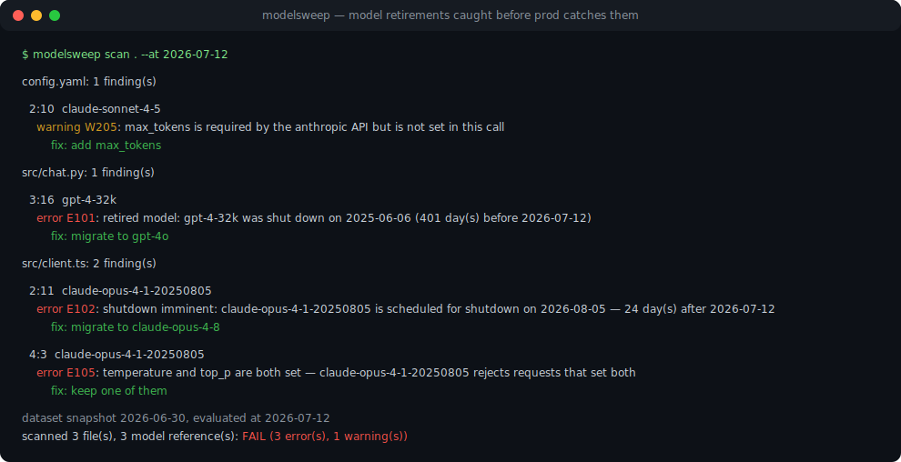
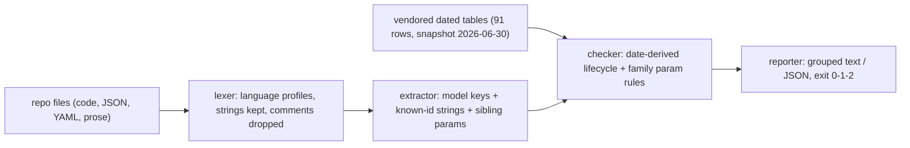

# modelsweep

[English](README.md) | [中文](README.zh.md) | [日本語](README.ja.md)

[](LICENSE)   [](CONTRIBUTING.md)

**一个开源、零依赖的预检扫描器，在你的仓库里揪出已弃用的模型 id 和非法参数组合——内置带日期的弃用数据表，让 CI 在模型退役搞垮生产环境之前先失败。**



```bash
# not yet on npm — install from a checkout of this repository
npm install && npm run build && npm pack
npm install -g ./modelsweep-0.1.0.tgz
```

## 为什么选 modelsweep？

模型退役按厂商的时间表打断生产环境，而不是按你的。2024 年钉死的那个 id 会一直正常工作，直到关停日当天所有请求集体 404——而引用它的代码上一次被人打开还是十八个月前。现有方案都有同一个盲区：厂商目录和路由注册表知道*有哪些*模型，却从不看*你的*代码；运行时的弃用警告要等请求已经开始劣化才出现在生产日志里；在 CI 里 grep 模型名只能找到字符串，完全不知道其中一个还有 24 天就要死了。modelsweep 既不是 SDK，不是路由器，也不是代理。它是一次预检扫描：内置一张覆盖五家厂商、由厂商公告的弃用与关停**日期**构成的数据表，配上一个能在代码、JSON 和 YAML 中找到模型引用的提取器——并顺带 lint 写在旁边的请求参数（Claude 模型上的 `temperature: 1.2`、推理模型上任何 `temperature`、已移除该参数家族上的 `budget_tokens`）。判定在扫描时由日期推导，因此排定的关停会随着日子临近从警告升级为错误，`--at` 能复现上个季度的判定结果，一行 CI 就能杜绝这一整类事故。

|  | modelsweep | 路由目录（LiteLLM） | 模型数据库（models.dev） | CI 里 grep |
|---|---|---|---|---|
| 定位 | 对你仓库的预检扫描 | 供路由器用的价格/限额数据 | 可浏览的模型元数据 | 字符串搜索 |
| 扫描你的代码 | 是——代码、JSON、YAML、文档 | 否 | 否 | 只有行，没有上下文 |
| 带天数计算的关停日期 | 是，警告→错误的时间窗 | 部分日期，无天数计算 | 部分，非机器校验 | 否 |
| 参数 lint | 是，按模型家族 | 否 | 否 | 否 |
| 拼写错误检测 | 是，模型键上有 did-you-mean | 否 | 否 | 否 |
| 离线可用 | 是，数据随包内置 | 是 | 否，它是网站/API | 是 |
| 运行时依赖 | 0 | ~25 | 不适用 | 不适用 |

<sub>能力与依赖数量基于各项目的公开文档和包元数据核对，2026-07。</sub>

## 特性

- **带日期的表，而非状态标签**——每一行都记录厂商公告的弃用与关停日期；状态在扫描时推导，所以 `--at 2027-01-01` 今天就能看到明年的故障，`--within 90` 在还来得及迁移时把临近的关停变成错误。
- **按代码真实的写法找引用**——JS/TS 对象、Python kwargs、Go 结构体、JSON 和 YAML 里的 `model:` 键；任何字符串字面量中的已知 id；Markdown 里的文字提及。注释永远不会命中，语言感知的词法分析确保 Python 注释里的 `#` 不会连累 URL 里的 `#`。
- **紧挨模型 id 的参数 lint**——提取器从同一个调用里捕获 `temperature`、`top_p`、`max_tokens`、嵌套的 `budget_tokens` 等，然后按被引用模型的家族检查：被拒绝的参数（E103）、超范围字面量（E104）、冲突组合（E105）、已弃用名称（W204）、缺失的必需参数（W205）。
- **每个可推导的发现都附修复建议**——退役模型给出厂商推荐的替代品，浮动别名给出应钉住的快照，拼错的 id 得到 did-you-mean，Chat Completions 上的 `max_tokens` 会指向 `max_completion_tokens`。
- **为 CI 而生**——输出确定性、`--format json`、`--strict`、可重复的 `--allow` 记录已接受的例外，退出码区分发现（1）与用法错误（2）；每份报告都打印数据快照日期，过期与否一目了然，绝不隐藏。
- **零运行时依赖，完全离线**——只需要 Node.js；弃用数据以可审查的源码形式随包分发，工具从不打开任何网络连接。

## 快速上手

安装：

```bash
# not yet on npm — install from a checkout of this repository
npm install && npm run build && npm pack
npm install -g ./modelsweep-0.1.0.tgz
```

把它对准内置遗留应用里的 TypeScript 客户端——一年没人打开过的代码：

```bash
modelsweep scan examples/legacy-app/client.ts --at 2026-07-12
```

输出（真实抓取的运行结果）：

```text
examples/legacy-app/client.ts: 5 finding(s)

  9:13  claude-opus-4-1
    error E102: shutdown imminent: claude-opus-4-1 resolves to claude-opus-4-1-20250805, which is scheduled for shutdown on 2026-08-05 — 24 day(s) after 2026-07-12
        fix: migrate to claude-opus-4-8
    warning W202: floating alias: claude-opus-4-1 points at a different snapshot over time (currently claude-opus-4-1-20250805)
        fix: pin claude-opus-4-1-20250805 explicitly

  11:5  claude-opus-4-1
    error E105: temperature and top_p are both set — claude-opus-4-1 rejects requests that set both
        fix: keep one of them

  18:32  claude-3-5-sonnet-latest
    error E101: retired model: claude-3-5-sonnet-latest resolves to claude-3-5-sonnet-20241022, which was shut down on 2025-10-28 (257 day(s) before 2026-07-12)
        fix: migrate to claude-sonnet-5
    warning W202: floating alias: claude-3-5-sonnet-latest points at a different snapshot over time (currently claude-3-5-sonnet-20241022)
        fix: pin claude-3-5-sonnet-20241022 explicitly

dataset snapshot 2026-06-30, evaluated at 2026-07-12
scanned 1 file(s), 2 model reference(s): FAIL (3 error(s), 2 warning(s))
```

退出码 1——原样放进 CI 即可。扫描整个 `examples/legacy-app` 目录会在一个 Python 任务、这个 TypeScript 客户端和一份 YAML 配置中得到 10 个错误、4 个警告；改用 `--at 2024-01-01` 重跑，生命周期类发现全部消失，因为那时还什么都没被弃用。想审问某一个 id（真实抓取的运行结果）：

```bash
modelsweep explain claude-opus-4-1 --at 2026-07-12
```

```text
claude-opus-4-1
  provider:     anthropic
  family:       anthropic-4
  resolves to:  claude-opus-4-1-20250805 (floating alias)
  status:       deprecated (as of 2026-07-12)
  deprecated:   2026-02-05
  shutdown:     2026-08-05
  replacement:  claude-opus-4-8
  parameter rules (anthropic-4):
    - temperature must be within 0..1
    - top_p must be within 0..1
    - top_k must be an integer >= 0
    - max_tokens is required on every request
    - temperature and top_p must not be set together
    - budget_tokens needs >= 1024 and < max_tokens
```

更多场景见 [examples/](examples/README.md)。

## 规则

错误（E1xx）表示请求会在厂商 API 上失败或已经失败；警告（W2xx）表示值得审查的漂移。规则码是稳定 API，从不重新编号。每条规则的完整依据见 [docs/rules.md](docs/rules.md)。

| 规则 | 级别 | 检查内容 |
|---|---|---|
| E101 | error | 在参考日期时模型已过公告的关停日期 |
| E102 | error | 关停排定在 `--within` 时间窗内（默认 90 天） |
| E103 | error | 模型家族直接拒绝的参数（如推理模型上的 `temperature`） |
| E104 | error | 字面量超范围或非法（Claude 上 `temperature: 1.2`、`budget_tokens < 1024`） |
| E105 | error | 冲突组合（Claude 4.x 上 `temperature` + `top_p`、`budget_tokens >= max_tokens`） |
| W201 | warning | 已弃用，关停在时间窗之外或尚未公告 |
| W202 | warning | 浮动别名——钉住它当前解析到的带日期快照 |
| W203 | warning | 厂商建议只调其一时同时设置 `temperature` + `top_p` |
| W204 | warning | 已弃用的参数名（Chat Completions 上的 `max_tokens`） |
| W205 | warning | 可见调用中缺失必需参数（Anthropic 上的 `max_tokens`） |
| W206 | warning | 已覆盖厂商前缀下的未知 id——通常是拼写错误，附 did-you-mean |

## CLI 参考

`modelsweep scan [paths...]` 执行扫描（默认 `.`）；`modelsweep models` 打印内置数据表；`modelsweep explain <id>` 详解单个 id。数据集覆盖 OpenAI、Anthropic、Google、Mistral 和 Cohere——快照 2026-06-30 共 91 行（来源与更新策略见 [docs/dataset.md](docs/dataset.md)）。

| 选项 | 默认值 | 效果 |
|---|---|---|
| `--at <YYYY-MM-DD>` | 今天 | 以该日期评估所有生命周期（CI 可复现、时间旅行） |
| `--within <days>` | `90` | 把 N 天内排定的关停从警告升级为错误 |
| `--format text\|json` | `text` | 报告格式；JSON 是供 CI 后处理的稳定结构 |
| `--strict` | 关 | 警告同样使运行失败（退出码 1） |
| `--allow <model-id>` | — | 抑制某个 id 的模型级发现（可重复） |
| `-q, --quiet` | 关 | 只输出数据集与汇总行 |

退出码：`0` 干净，`1` 有发现（或 `--strict` 下有警告），`2` 用法/IO 错误——脚本因此能区分「模型将死」与「命令写错」。

## 架构



## 路线图

- [x] 覆盖五家厂商的带日期弃用表、双通道提取、按家族的参数 lint、11 条规则目录、`--at`/`--within` 时间计算、scan/models/explain CLI、JSON 输出（v0.1.0）
- [ ] `--refresh` 配套脚本：从厂商公告重新生成数据表，同时保持数据内置的模式
- [ ] 微调模型 id 支持（`ft:gpt-…` 映射到其基础模型行）
- [ ] Azure/Bedrock/Vertex 平台 id 写法及平台专属退役日期
- [ ] SARIF 输出以对接代码扫描平台

完整列表见 [open issues](https://github.com/JaydenCJ/modelsweep/issues)。

## 贡献

欢迎贡献——尤其欢迎附带出处的数据表修正。先 `npm install && npm run build` 构建，然后运行 `npm test`（90 个测试）和 `bash scripts/smoke.sh`（必须打印 `SMOKE OK`）——本仓库不附带 CI，上面的每一条声明都由本地运行验证。参阅 [CONTRIBUTING.md](CONTRIBUTING.md)，认领一个 [good first issue](https://github.com/JaydenCJ/modelsweep/issues?q=is%3Aissue+is%3Aopen+label%3A%22good+first+issue%22)，或发起一个 [discussion](https://github.com/JaydenCJ/modelsweep/discussions)。

## 许可证

[MIT](LICENSE)
